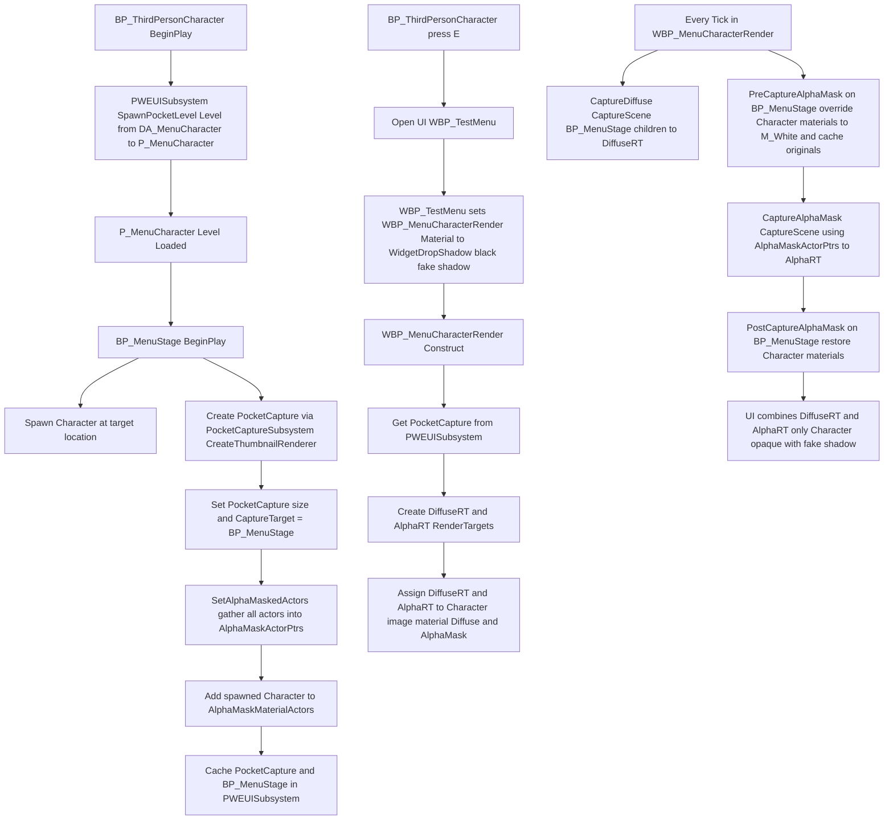

### 🏷 摘要

> PocketWorldExample是学习Lyra中的PocketWorld插件的一个最小集示例项目，介绍了如何使用这个插件。
> 

---

### 流程

1. BP_ThirdPersonCharacterde beginplay通过PWEUISubsystem的`SpawnPocketLevel`spawn一个subLevel，Level路径来自DA_MenuCharacter的Level，Level名为P_MenuCharacter
2. P_MenuCharacter中摆放了一个BP_MenuStage的蓝图
3. BP_MenuStage在关卡创建时beginplay
    1. 生成一个character在指定位置
    2. 通过PocketCaptureSubsystem的`CreateThumbnailRenderer` 创建一个PocketCapture
    3. 设置了PocketCapture的大小和CaptureTarget为BP_MenuStage
    4. 递归收集了所有Actor 通过`SetAlphaMaskedActors` 存放在`AlphaMaskActorPtrs` 
    5. 把生成的character存放在AlphaMaskMaterialActor的数组中
    6. 把上述生成的PocketCapture和BP_MenuStage缓存到PWEUISubsystem中
4. BP_ThirdPersonCharacter中按下E键打开UI  WBP_TestMenu
5. WBP_TestMenu把WBP_MenuCharacterRender的公共变量Material设置到WidgetDropShadow上，WidgetDropShadow的color是全黑，这样可以得到一个假阴影（通过WidgetDropShadow的位置偏移得到，不受光照变化影响）
6. WBP_MenuCharacterRender在Construct时通过PWEUISubsystem拿到刚才创建的PocketCapture并创建两张RrenderTexture，分别对应颜色和透明度。通过SetTextureParameterValue设置到图片控件Character的AlphaMask和Diffuse上。
7. 然后WBP_MenuCharacterRender每一帧Tick
    1. 叫PocketCapture执行`CaptureDiffuse` 获取BP_MenuStage子节点下的所有Actor然后通过`CaptureScene` 拍下来存到Diffuse那张RT上。
    2. 通过事件PreCaptureAlphaMask让BP_MenuStage把上面存下来的Character的材质设置成M_White（纯白）这样CaptureScene就能看到了，同时把原来的对应的材质存下来。
    3. 叫PocketCapture执行`CaptureAlphaMask` ，它会把BP_MenuStage上面存下来的所有Actor的材质设置成`AlphaMaskActorPtrs` ，但是这个变量没有设置所以CPP这边没有材质覆写，都保持原来的。所以只有上面生成的Character能被看到。因为这层只Capture Alpha层，所以和颜色无关。
    4. 通过事件PostCaptureAlphaMask让BP_MenuStage把Character的材质还原。
8. Diffuse和AlphaMask的RT叠加会得到只有Character的抠图效果。因为只有Character的透明度是1

