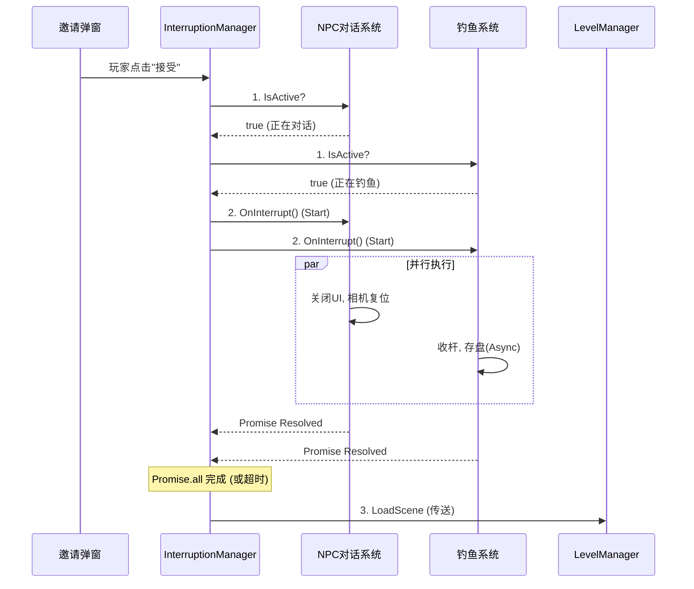

**摘要**：在基于 Puerts/TS 的手游开发中，"传送"或"接受邀请"是一个高风险操作。如果处理不当，会导致逻辑残留、UI 报错或数据丢失。本文介绍一种基于 **控制反转 (IoC)** 和 **异步并行** 的中断系统设计模式。

---

## 1. 🔥 痛点：为什么直接 OpenLevel 会崩？

当玩家点击“去好友房间”时，游戏可能处于以下状态：

- **NPC 对话中**：直接切场景会导致对话回调无法执行，相机无法复位。
- **强化装备中**：材料已放入槽位，但未点击确认。直接切场景导致材料丢失。
- **钓鱼中**：处于输入锁定状态。直接切场景导致玩家在新地图无法移动。

**核心问题**：邀请系统（Inviter）无法预知其他业务系统的内部状态，强行销毁是不安全的。

---

## 2. 🧩 解决方案：中断总线设计

我们需要建立一个协议，让邀请系统只负责**发起信号**，各业务系统**自己清理自己**。

### 2.1 🧾 接口定义

```tsx
export enum EInterruptionReason {
    LevelTransition, // 切场景 (最严重)
    OpenFullScreenUI, // 打开全屏界面 (次级)
}

export interface IInterruptibleSystem {
    /**
     * 1. 快速检查：当前系统是否活跃？
     * 优化点：如果不活跃，管理器直接跳过，不创建 Promise。
     */
    IsActive(): boolean;
    
    /**
     * 2. 询问：能不能被打断？
     * 例如：关键剧情动画播放中，返回 false，阻止传送。
     */
    CanInterrupt(reason: EInterruptionReason): boolean;
    
    /**
     * 3. 执行：清理逻辑
     * 必须返回 Promise，以便管理器等待异步操作（如存盘、收杆动画）完成。
     */
    OnInterrupt(reason: EInterruptionReason): Promise<void>;
}
```

---

## 3. 🧱 实现：类型守卫与装饰器

由于 TS 接口在运行时会被擦除，我们需要一种机制在运行时识别“谁实现了接口”。推荐使用 **装饰器 (Decorator)**。

```tsx
// Core/Decorators.ts

// 定义一个 Symbol 标记
const INTERRUPTIBLE_KEY = Symbol("__IS_INTERRUPTIBLE__");

// 类装饰器：打上标记
export function Interruptible(constructor: Function) {
    constructor.prototype[INTERRUPTIBLE_KEY] = true;
}

// 类型守卫：检查对象是否可中断
export function IsInterruptible(sys: any): sys is IInterruptibleSystem {
    return !!(sys && sys[INTERRUPTIBLE_KEY]);
}
```

---

## 4. ⚙️ 中断管理器：并行与熔断

`InterruptionManager` 是核心调度者。它必须保证**效率**（并行处理）和**安全**（超时熔断）。

```tsx
// Systems/InterruptionManager.ts

class InterruptionManager {
    
    // 执行中断流程
    async ExecuteInterrupt(reason: EInterruptionReason): Promise<boolean> {
        const allSystems = SystemManager.GetAllSystems();
        const tasks: Promise<void>[] = [];

        // 1. 遍历与检查
        for (const sys of allSystems) {
            // 检查是否挂了装饰器
            if (IsInterruptible(sys)) {
                // 检查是否拒绝中断
                if (!sys.CanInterrupt(reason)) {
                    console.warn(`系统 ${sys.constructor.name} 拒绝中断！`);
                    return false; 
                }
                
                // 检查是否活跃 (性能关键)
                if (sys.IsActive()) {
                    // 收集清理任务
                    tasks.push(sys.OnInterrupt(reason));
                }
            }
        }

        // 2. 如果没有活跃系统，直接通过
        if (tasks.length === 0) return true;

        // 3. 并行等待 + 超时保护
        // 创建一个 2秒 的超时 Promise
        const timeoutTask = new Promise<void>((_, reject) => {
            setTimeout(() => reject(new Error("Timeout")), 2000);
        });

        try {
            // Promise.race 确保即使某个系统卡死，2秒后也会强制继续
            await Promise.race([Promise.all(tasks), timeoutTask]);
        } catch (e) {
            console.error("中断清理超时或出错，强制执行传送", e);
        }

        return true;
    }
}
```

---

## 5. 🎣 业务系统案例：钓鱼系统

钓鱼系统展示了如何利用这个架构处理复杂的清理逻辑。

```tsx
// Systems/FishingSystem.ts

@Interruptible // 1. 挂装饰器
class FishingSystem extends BaseSystem implements IInterruptibleSystem {
    
    private _state = FishingState.Idle;

    // 2. 状态检查
    IsActive(): boolean {
        return this._state !== FishingState.Idle;
    }

    CanInterrupt(reason: EInterruptionReason): boolean {
        // 钓鱼随时可以被打断
        return true;
    }

    // 3. 清理逻辑
    async OnInterrupt(reason: EInterruptionReason) {
        console.log("检测到传送，强制收杆...");
        
        // 停止动画表现
        this.StopFishingAnim();
        
        // 发送网络请求保存当前收益 (耗时操作)
        await this.Network.SaveFishData();
        
        // 重置本地状态
        this._state = FishingState.Idle;
        
        console.log("钓鱼系统清理完毕");
    }
}
```

---

## 6. 🧠 总结：流程全景图



通过这种架构，我们实现了：

1. **高内聚低耦合**：邀请系统不需要知道其他系统的存在。
2. **数据安全**：利用 `await` 确保了关键数据（如鱼获）在传送前已保存。
3. **用户体验**：并行处理将总等待时间降至最低，超时机制防止了游戏卡死。
