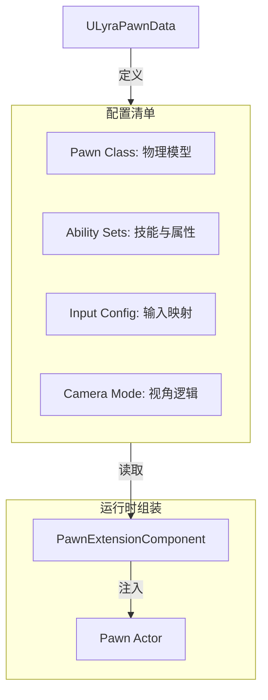
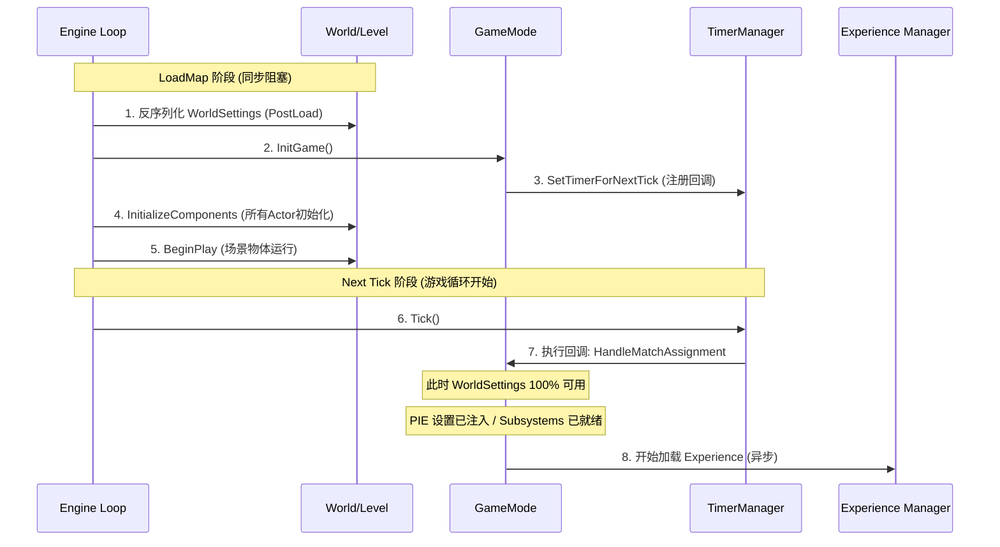
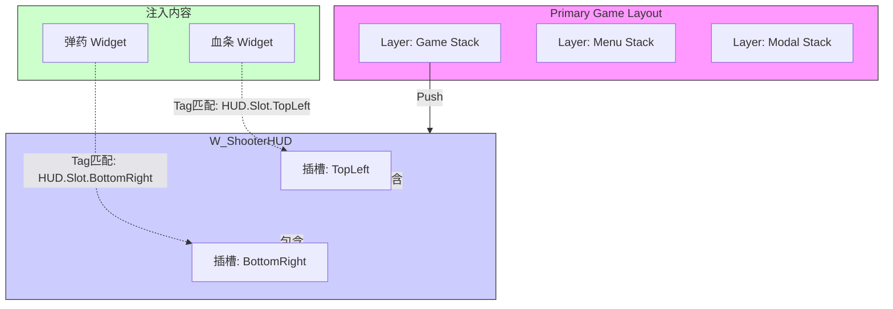

**摘要**：Lyra Starter Game 不仅仅是一个示例项目，它是 Epic Games 对“现代模块化游戏开发”的最佳实践展示。本文将深度拆解 Lyra 的配置解耦、初始化时序、UI 扩展架构以及跨地图数据持久化机制，帮助开发者理解如何构建可扩展的大型游戏框架。

---

## 🧩 1. 核心解耦：角色定义的革命 (Pawn Data)

在传统 UE 开发中，我们习惯于创建 `BP_Hero` 并把技能、输入、相机逻辑都写在里面。Lyra 彻底摒弃了这种做法，采用了 **Data-Driven（数据驱动）** 的设计。

### 🗺️ 1.1 架构图：组装流水线



### 💡 1.2 关键代码：PawnExtensionComponent

`ULyraPawnExtensionComponent` 是角色的“大管家”。它负责协调初始化流程，确保 GAS（Gameplay Ability System）在 PlayerState 和 Controller 就绪后才初始化。

```cpp
// LyraPawnExtensionComponent.cpp (核心逻辑伪代码)

void ULyraPawnExtensionComponent::CheckDefaultInitialization()
{
    // 1. 检查依赖项是否就绪
    if (!GetPawn() || !GetController() || !GetPlayerState()) 
    {
        return; // 等待下一帧重试
    }

    // 2. 获取数据资产 (PawnData)
    const ULyraPawnData* PawnData = GetPawnData<ULyraPawnData>();

    // 3. 初始化 GAS (赋予技能)
    if (PawnData)
    {
        for (const ULyraAbilitySet* Set : PawnData->AbilitySets)
        {
            Set->GiveToAbilitySystem(AbilitySystemComponent, ...);
        }
    }
    
    // 4. 初始化输入
    InitializePlayerInput(PawnData->InputConfig);
}
```

---

## ⏱️ 2. 初始化的奥秘：GameMode 的“延迟一帧”

在 `ALyraGameMode` 中，有一个看似奇怪的设计：它不会在 `InitGame` 中立即读取配置，而是延迟到下一帧。

### 📈 2.1 时序图：为什么必须等待？



**核心结论**：延迟一帧是为了避开引擎初始化的“混沌期”，确保 `WorldSettings`、`AssetManager` 和 `GameInstanceSubsystem` 都已完全就绪，从而安全地读取 `DefaultGameplayExperience` 配置。

---

## 🚀 3. 动态注入：GameFeature 与 Action 系统

Lyra 的核心哲学：**地图只是容器，玩法通过插件注入。**

### 📦 3.1 配置结构

在 `LyraExperienceDefinition` 中，配置分为两部分：

- **Action Sets (通用包)**：如 `SharedInput`（WASD移动），`StandardHUD`（基础界面）。
- **Actions (特有包)**：如 `AddComponents`（挂载夺旗计分器），`AddAbilities`（给予特定武器）。

### 🔌 3.2 运行时注入流程

当 Experience 加载完毕后，`GameFeatureAction` 会被激活：

```cpp
// UGameFeatureAction_AddComponents.h 的逻辑
void OnGameFeatureActivating()
{
    // 监听 GameState 的创建
    GameFrameworkComponentManager->AddExtensionHandler(
        ALyraGameState::StaticClass(), 
        [](AActor* Actor, FName Event) {
            // 当 GameState 出生时，动态 AddComponent
            Actor->AddComponentByClass(MyScoreComponentClass, ...);
        }
    );
}
```

这种模式解决了 **“时序倒挂”** 问题：GameFeature 激活时，核心 Actor 往往已经存在，或者即将生成，注入逻辑保证了组件能正确挂载。

---

## 🖼️ 4. UI 架构：Stack (栈) 与 Extension (注入)

Lyra 结合了 **CommonUI** 的层级管理和 **Extension** 的去中心化注入。

### 🥪 4.1 UI 架构图：三明治结构



- **Stack (宏观)**：控制层级。按下 ESC，暂停菜单被 Push 到 `L_Menu` 层，盖住 `L_Game` 层，并捕获输入焦点。
- **Extension (微观)**：控制内容。血条 Widget 不需要知道 HUD 的存在，只要声明自己去 `HUD.Slot.TopLeft`，系统就会自动把它填进去。

---

## 💾 5. 数据持久化：Subsystem vs PlayerState

在跨地图（ServerTravel）时，GameMode 和 PlayerState 会被销毁。Lyra 使用 **GameInstance Subsystem** 作为数据的“诺亚方舟”。

| **特性** | **PlayerState (钱包)** | **GameInstance Subsystem (银行)** |
| --- | --- | --- |
| **生命周期** | 单局游戏 (随关卡销毁) | 整个程序运行期 (常驻内存) |
| **网络同步** | 支持 (Replicated) | 不支持 (本地独有) |
| **GAS支持** | 是 (作为 Owner/Avatar) | 否 |
| **用途** | 局内战斗计算、计分、同步 | 跨局背包、设置、Session 管理 |

**最佳实践流程**：

1. **进图前**：UI 或大厅逻辑将数据写入 Subsystem。
2. **进图后**：`OnExperienceLoaded` 或 `PawnExtension` 从 Subsystem 读取数据，写入新的 PlayerState。
3. **出图前**：局内逻辑将 PlayerState 的最终结果（如获得的经验值）存回 Subsystem。
